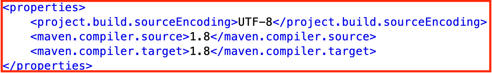

# Miinaharava

[Maven-projektin päähakemistoon](https://github.com/TommiON/ot-harjoitustyo/tree/master/MineSweeper)

[MineSweeper pre-release 2](https://github.com/TommiON/ot-harjoitustyo/releases/tag/v0.9)

## Sovelluksen tarkoitus

Sovellus toteuttaa klassisen Miinaharva-pelin. Sovellus ei sisällä omia sääntölisäyksiä tai -muunnelmia, vaan noudattaa alkuperäisen pelin sääntöjä, jotka [löytyvät esimerkiksi Wikipediasta](https://fi.wikipedia.org/wiki/Miinaharava_(peli)).

## Dokumentaatio

[Käyttöohje](https://github.com/TommiON/ot-harjoitustyo/blob/master/dokumentointi/käyttöohje.md)

[Vaatimusmäärittely](https://github.com/TommiON/ot-harjoitustyo/blob/master/dokumentointi/vaatimusmäärittely.md)

[Arkkitehtuurin kuvaus](https://github.com/TommiON/ot-harjoitustyo/blob/master/dokumentointi/arkkitehtuuri.md)

[Testausraportti](https://github.com/TommiON/Miinaharava/blob/master/dokumentointi/testaus.md)

[Työaikakirjanpito](https://github.com/TommiON/ot-harjoitustyo/blob/master/dokumentointi/tyoaikakirjanpito.md)

## Huomio suoritusympäristöstä

Sovelluksen graafinen käyttöliittymä on toteutettu JavaFX:lla, mistä syystä sovellus vaatii Java-ympäristöstä version 8 (eli Javan hämmentävässä versionumeroinnin käytännössä 1.8:n). Tämä on asetettu myös Maven-projektin POM.xml-konfigurointitiedostoon:



Sovellus ei (todennäköisesti) suostu toimimaan Java 11 -ympäristössä.

## Komentorivitoiminnot

#### Kääntäminen ja ajaminen

```shell
mvn compile exec:java -Dexec.mainClass=main.Main
```

Suoritettavan .jar-tiedoston generoiminen

```shell
mvn package
```

#### Testit ja staattinen analyysi

Testien ajaminen

```shell
mvn test
```

Testikattavuusraportti (Jacoco). Kattavuusraportti löytyy tiedostosta _target/site/jacoco/index.html_

```shell
mvn jacoco:report
```

Koodityylin tarkistus (Checkstyle). Tyyliraportti löytyy tiedostosta _target/site/checkstyle.html_

```shell
mvn jxr:jxr checkstyle:checkstyle
```

#### Dokumentointi

JavaDocin generointi:

```shell
mvn javadoc:javadoc
```
