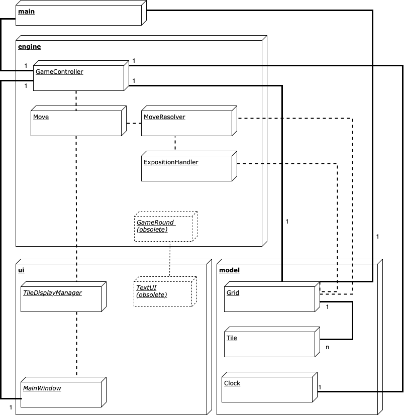
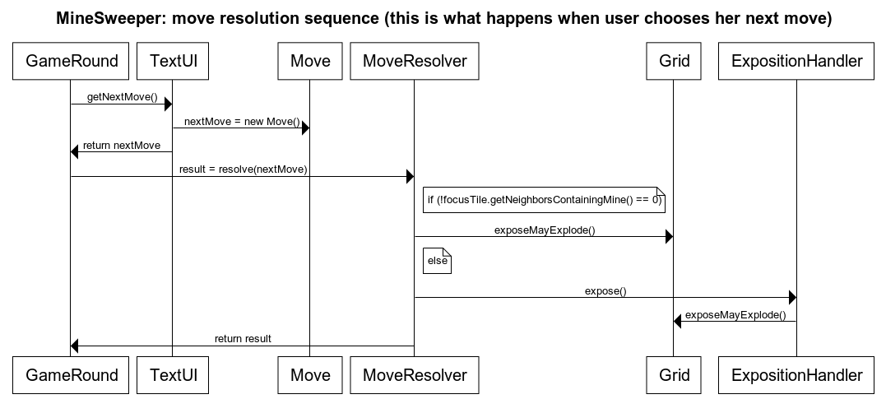
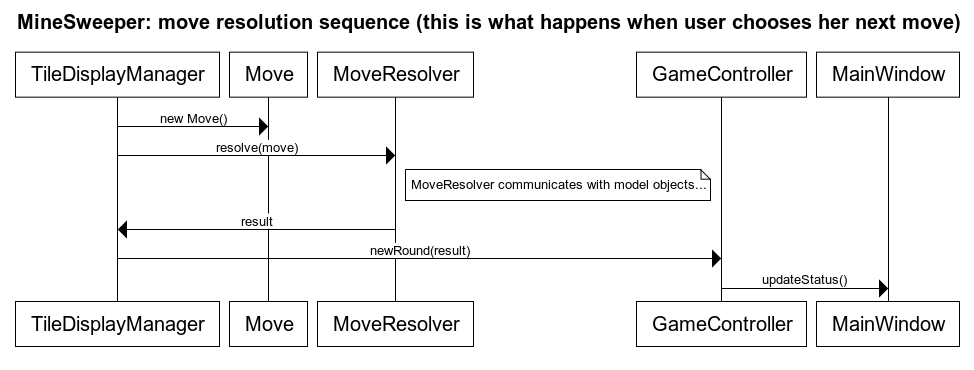

# MineSweeper: arkkitehtuuri

## Pakkaus- ja luokkarakenne

Luokat on jaettu neljään pakkaukseen:

_Model_-pakkaus sisältää sovelluksen datan ja tätä dataa suoraan muokkaavan toiminnallisuuden. _Grid_-luokka mallintaa _Tile_-olioista koostuvan pelilaudan. _Grid_-luokan merkittävin toiminnallisuus liittyy satunnaisen pelilaudan generointiin, mutta se tarjoaa testejä varten myös vaihtoehtoisen konstruktorin, jolle voi antaa ei-satunnaisen pelilaudan merkkijonona. Itse pelitilanne on pohjimmiltaan tallennettu _Tile_-olioissa. Erillisenä luokkana on vielä _Timing_, joka huolehtii ajanotosta.

_Ui_-pakkaus sisältää käyttöliittymäkomponentit. Pakkauksen pääluokka on _MainWindow_. Se käynnistetään sovelluksen käynnistyessä ja ylläpitää pääikkunaa, johon käyttöliittymä rakennetaan asianmukaisista olioista. Itse pelilaudan näyttäminen on delegoitu _GridDisplayManager_-oliolle, joka edelleen delegoi yksittäisten ruutujen näyttämisen ja klikkauksiin reagoimisen _TileDisplayManager_-oliolle. Ikkunan alalaidan statustekstistä _MainWindow_ huolehtii itse, mutta tämäkin on tarkoitus delegoida erilliselle oliolle yleisen siisteyden vuoksi.

Arkkitehtuurissa _ui_- ja _model_-pakettien luokat eivät kommunikoi suoraan. Välittäjänä toimii _engine_-pakkaus, joka sisältää pelin "moottorin". Aiemmassa, tekstipohjaisessa versiossa pelin kulku oli mallinnettu while-silmukkana _GameRound_-luokassa. Graafinen versio toimii reaktiivisesti (kun käyttäjä klikkaa jotain ruutua) ja ajastetusti (kellon päivittäminen). Näistä toimista ja pelin loppumisesta huolehtii _GameController_-luokka. Yksittäinen siirto on mallinnettu _Move_-oliona. _MoveResolver_ laskee ja palauttaa yksittäisen siirron lopputuloksen. _ExpositionHandler_ on edellisestä eriytetty apuluokka, joka huolehtii nollaruutualueiden paljastamisesta käyttäen leveyshakutyyppistä algorimia.

Lisäksi sovelluksessa on _Main_-paketti, joka sisältää vain _Main_-luokan ja huolehtii varsinaisten työolioiden luomisesta ja alustamisesta.

## Esimerkki luokkien toiminnasta

Pelin keskeisin tapahtumaketju on käyttäjän siirron lukeminen ja käsittely. Tekstipohjaisessa versiossa tämä oli toteuttu silmukkana _GameRound_-luokassa:

Graafisessa versiossa arkkitehtuuri on muutettu reaktiiviseksi: aloite tulee _TileDisplayManager_-luokalta, joka rekisteröi käyttäjän klikkauksen, luo _Move_-olion ja informoi tästä _GameController_-luokkaa:

## Ohjelman rakenteeseen jääneet heikkoudet

Ajanpuutteen vuoksi ohjelmaan jäi ainakin seuraavat puutteet:

* Graafista käyttöliittymää päivittävä koodi on optimoimatonta. Jotta ExpostionHandler-luokan tekemä massapaljastus heijastuisi  käyttöliittymään, _koko ruudukon_ päivittävää toiminnallisuutta kutsutaan jokaisen siirron jälkeen, vaikka TileDisplayManager-luokka osaa päivittää yksittäisen ruudun ja useimmissa tapauksissa tämä olisi riittävää. Yhdessä JavaFX:n yleisen tehottomuuden kanssa tämä tekee käyttöliittymästä hieman hitaan. Asian olisi voinut ratkaista esim. lisäämällä MoveResolver-luokan palautusarvoihin uusi arvo, joka kertoo, milloin kyseessä on massapaljastus.
* MoveResolver-luokan palautusarvo ilmaistaan kovakoodattuina kokonaislukuina, mikä on potentiaalinen bugien lähde. Parempi ratkaisu olisi enumeraatiotyyppi, joka sisältää mahdolliset lopputulemat.
