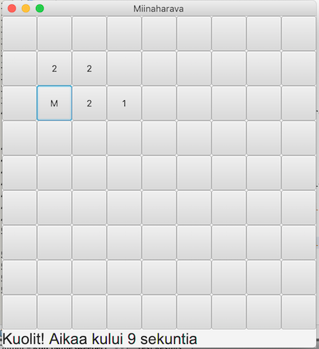

# Miinaharava: käyttöohje

## Lataus ja käynnistys

Lataa tiedosto [MineSweeper.jar](https://github.com/TommiON/ot-harjoitustyo/releases/download/v0.9/MineSweeper.jar). Mene hakemistoon, jossa tiedosto sijaitsee, ja anna komento

```shell
java -jar MineSweeper.jar
```

## Pelaaminen

Pelilauta on 9 x 9 ruudun kokoinen ja siihen on satunnaisesti sijoiteltu 10 miinaa. Tavoitteena on paljastaa kaikki miinoittamattomat ruudut ja olla paljastamatta yhtään miinoitettua ruutua.



Ruutu paljastetaan klikkaamalla sitä. Jos ruudussa on miina (M), se RÄJÄHTÄÄ ja peli päättyy tappioon. Jos ruutu on miinoittamaton, paljastettaessa se näyttää, montako miinaa sitä ympäröivissä kahdeksassa ruudussa on. Jos tämä luku on nolla, paljastetaan myös kaikki paljastettuun ruutuun yhteydessä olevat ruudut, joita ympäröivissä ruuduissa on myös nolla miinaa, sekä kaikki tätä aluetta reunustavat miinoittamattomnat ruudut.

Ruudun voi myös liputtaa (#), jos päättelee sen olevan miinoitettu. Lippu on varokeino, jolla voi varmistaa, ettei vahingossa paljasta miinoitettua ruutua. Liputtaminen tehdään klikkaamalla hiiren oikeata/toissijaista nappia. Liputettua ruutua ei voi paljastaa, mutta lipun voi poistaa klikkaamalla ruutua uudelleen hiiren oikealla/toissijaisella napilla.

Pelin päätyttyä joko voittoon tai tappioon alalaidan statusrivillä näytetään kulunut aika. Tämän jälkeen voi aloittaa uuden pelin painamalla sovelluksen ainoata pelilaudan ulkopuolista painiketta. Pelin aikana samalla painikkeella voi peruuttaa pelin (pakotettu häviö).
