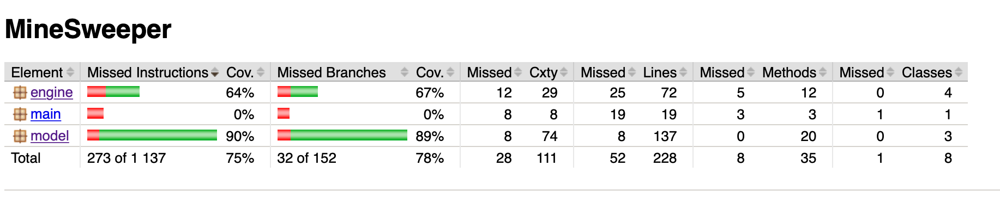

# Miinaharava: testausraportti

Sovellusta on testattu automaattisilla yksikkö- ja integraatiotesteillä (JUnit) sekä manuaalisilla käyttöliittymä- ja järjestelmätesteillä.

## Yksikkö- ja integraatiotestit

_Model_ ja _Engine_-pakettien luokille laadittiin pääluokan mukaan nimetyt testiluokat, poikkeuksena _GameController_, jonka järkevä testaaminen osoittautui käytettävissä olevassa ajassa liian vaikeaksi ja on automatisoidun testauksen ulkopuolella. _Grid_-luokalle on kaksi testiluokkaa: _GridTest_ käyttää pelitilanteessa käytettävää konstruktoria, _StaticGridTest_ ei-satunnaista konstruktoria. Jälkimmäisellä ei sinänsä ole merkitystä loppukäyttäjän toiminnallisuuden kannalta, mutta sen oikea toiminta on oleellista muille testeille.

Integraatiotestauksessa keskityttiin siihen, miten _Engine_ -pakkauksen luokat ja _Grid_-luokka vuorovaikuttavat keskenään. Tässä hyödynnettiin mock-olioiden ohella _Gridin_ vaihtoehtoista, nimenomaan testejä varten luotua staattista konstruktoria, jolle voi antaa ei-satunnaisen pelilaudan merkkijonoparametrina. (_Engine_-pakkauksen luokkien järkevä testaaminen olisi jokseenkin mahdotonta, jos testin käynnistyessä pelilaudan sisältö olisi mitä milloinkin sattuu.)

Jacocon raportoima testien rivikattavuus on 75 prosenttia ja haaraumakattavuus 78 prosenttia. Kattavuudesta on jätetty pois käyttöliittymäluokat sekä _GameRound_-luokka, joka ei ole toiminnallinen osa sovelluksen graafista versiota.

## Käyttöliittymätestaus

Manuaalinen käyttöliittymätestaus koostui kahdesta osiosta: graafisen käyttöliittymän erilaisten käyttötapausten kokeilemisesta (melko nopeasti tehty, koska käyttöliittymä on verraten yksinkertainen) sekä komentorivin parametrien validointitestauksesta (sovellukselle syötettiin käynnistettäessä erilaisia, sekä luvallisia että luvattomia paramtereja). Kummassakaan osiossa ei havaittu vakavia puutteita. Graafisen käyttöliittymän testauksessa havaittiin kuitenkin lieviä suorituskykyongelmia ts. hetkittäistä hidastumista. Tämän syistä lyhyt analyysi arkkitehtuurikuvauksen lopussa.

## Järjestelmätestaus

Sovellusta testattiin manuaalisesti varsinaisessa kehitysympäristössä (MacOS 10.14.6) sekä yliopiston Linux-palvelimella (melkki.cs.helsinki.fi). Jälkimmäisessä ympäristössä havaittiin Java-ympäristön versioriippuvuus, josta enemmän projektin Readme-etusivulla.
